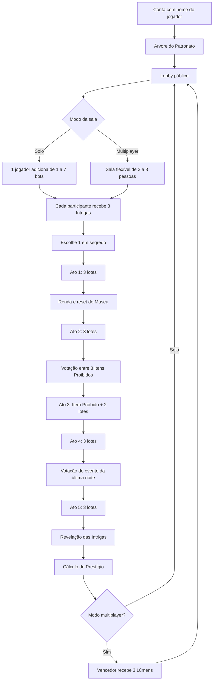

# Mapa de Game Design — Leilão da Meia-Noite

Versão de referência: agosto de 2026.

## Visão do jogo

Jogo social competitivo para 2 a 8 pessoas, com treino solo contra bots. Cada jogador usa ouro para disputar relíquias, transforma peças em infusões, negocia com rivais e administra poderes e maldições. O vencedor é quem possui mais Prestígio depois de cinco atos.

Pilares:

1. **Leilão com leitura de mesa:** decidir quanto uma peça vale para você e quanto vale impedir um rival de comprá-la.
2. **Museu como construção de estratégia:** cada relíquia altera recursos, cria ameaças ou abre uma receita de infusão.
3. **Negociação social:** vender pode ser correto mesmo fortalecendo outro jogador, pois gera ouro e Prestígio.
4. **Informação incompleta:** talentos, intenção de compra e Intrigas Secretas dificultam saber o plano real de cada jogador.
5. **Risco controlado:** maldições, missões e poderes de chance oferecem efeitos fortes com custos legíveis.

## Fluxo completo



## Estrutura da partida

| Elemento | Regra atual |
|---|---|
| Jogadores | Multiplayer com 2 a 8 pessoas; solo com 1 humano e 1 a 7 bots |
| Atos | 5 |
| Lotes | 3 por ato, 15 no total, sorteados novamente em cada partida |
| Ouro inicial | 15; Bolsa do Patrono acrescenta 3 |
| Renda entre atos | 5, com bônus e descontos de talentos, pobreza e maldições |
| Esmola do Anfitrião | Jogadores empatados com o menor ouro recebem +2 |
| Ativações de artefatos | 2 por ato; talentos elevam para 3 e depois 4 |
| Infusões | No máximo 1 por ato; dupla custa 2, tripla custa 4 |
| Mercado entre Museus | Peça uma relíquia rival oferecendo ouro ou ofereça uma peça sua com preço definido; o comprador realiza 1 compra por ato, ou 2 com Contrabandista |
| Votação proibida | Depois do sexto lote; empate é decidido aleatoriamente |
| Evento da última noite | Antes do quinto ato; a corte escolhe Feira dos Fragmentos, Tribunal das Máscaras ou Mercado dos Rostos Roubados. No Mercado, cada máscara é uma disputa separada: vence o maior lance secreto de 1–5 Selos, com empate favorável ao menor Prestígio |
| Vitória | Maior Prestígio final |

## Recursos e conversões

### Ouro

Entradas: renda, Esmola do Anfitrião, poderes, reembolsos e vendas.

Saídas: lances, compras, infusões, multas, conversões e talentos ativos.

No placar final, cada 4 moedas valem 1 Prestígio, limitado a 3. Isso evita que guardar ouro seja melhor do que participar do leilão.

### Prestígio

O placar é calculado assim:

```text
Prestígio final =
  valor das relíquias e infusões no Museu
  + bônus de talentos, poderes e vendas
  + bônus da Intriga Secreta cumprida
  + bônus de ouro restante (máximo 3)
  - penalidades de maldições
```

Infusões já possuem seu próprio valor de Prestígio e substituem as peças consumidas. Elas não recebem uma segunda pontuação de combo, evitando contagem dupla.

### Lúmens

São a progressão permanente da conta. O vencedor de uma partida multiplayer recebe 3 Lúmens. O modo solo não altera Lúmens nem vitórias. O primeiro talento é gratuito; os seguintes custam 2, 3, 5, 8 ou 12 conforme a profundidade da árvore.

### Maldições

Relíquias amaldiçoadas são peças premium com um preço tático, não armadilhas sem recompensa. Uma penalidade direta nunca reduz uma relíquia comum amaldiçoada abaixo de 2 Prestígios líquidos. Cumprir a condição da maldição ou purificá-la recupera o valor premium completo.

Maldições econômicas preservam o Prestígio da peça e descontam a renda entre atos. Ao transferir a Maçã Solar de Luna, o comprador original preserva o Prestígio conquistado e o rival recebe uma versão sem valor que reduz a renda duas vezes. Depois da segunda cobrança, a maldição se encerra e a Maçã transferida passa a valer 1 Prestígio.

## Conteúdo atual

| Sistema | Quantidade | Função |
|---|---:|---|
| Relíquias comuns | 42 | Cada partida sorteia uma rotação diferente de 15 lotes e garante ao menos duas receitas duplas possíveis |
| Itens Proibidos | 8 | Candidatos à votação do meio da partida; inclui FABIANA, A Criadora |
| Infusões | 34 | Transformações duplas ou triplas |
| Talentos | 27 | Progressão permanente em 5 ramos |
| Intrigas Secretas | 8 | Objetivos de partida com recompensa de 4 ou 5 Prestígios |
| Figuras da lore | 29 | Todas aparecem em artefatos, infusões e conteúdo secreto; não são personagens selecionáveis |

## Identidade do jogador e Crônicas dos 29 Nomes

O nome criado no cadastro é a identidade exibida na sala, no leilão, nas negociações e no placar. Não existe seleção de personagem nem vantagem ligada a Cajango, Dialgo, Feliciano ou Dimas.

Os nomes da Crônica pertencem ao mundo do jogo e assinam relíquias, maldições, infusões, Itens Proibidos e Intrigas Secretas. Osso Revestido de Dialgo, Baralho Marcado de Feliciano, Manopla Destruidora de Cajango e Martelo da Última Palavra de Dimas fazem parte do catálogo, mas agora disputam espaço na rotação aleatória como as demais peças. Roman, Galthak, Daniel Ramos, Haika Kimira, Giovana e Ana Clara possuem relíquias e infusões próprias. FABIANA, A Criadora é um Item Proibido de 9 Prestígios cujo poder concede 5 moedas, 5 Prestígios, proteção contra uma maldição e uma ativação adicional no ato.

## Intrigas Secretas

Cada jogador recebe três opções aleatórias e escolhe uma. O servidor remove as opções e o objetivo dos rivais antes de enviar o estado a cada cliente. Somente a indicação “intriga selada” é pública. Todos os objetivos são revelados depois do último lote e antes do placar.

| Intriga | Condição | Recompensa |
|---|---|---:|
| Sangue Azul | 3 relíquias de Realeza | +4 |
| Mercador de Cadáveres | 2 relíquias vendidas | +4 |
| Mãos Ensanguentadas | 3 poderes direcionados contra rivais | +5 |
| Devoto do Proibido | 1 Item Proibido no Museu | +5 |
| Museu Amaldiçoado | 3 maldições ativas | +5 |
| Último Apostador | No máximo 1 moeda ao final | +4 |
| Colecionador Obsessivo | 5 relíquias no Museu | +5 |
| Conspirador da Corte | Negociar com 2 jogadores diferentes | +4 |

O mercado funciona nas duas direções. Ao selecionar outro jogador, é possível pedir uma peça do Museu dele ou oferecer uma peça do próprio Museu. O destinatário pode aceitar, recusar ou contrapropor; quem enviou pode retirar a proposta enquanto aguarda. Ouro, posse da relíquia e limite de compras são validados novamente no aceite.

Decisões de equilíbrio:

- A recompensa representa aproximadamente o valor de uma relíquia forte, suficiente para mudar o vencedor sem apagar o restante da partida.
- Os objetivos de 5 pontos exigem risco maior ou dependem de uma disputa mais difícil.
- Infundir reduz a quantidade de peças e pode atrapalhar Colecionador Obsessivo, criando uma decisão real.
- Purificar uma maldição pode atrapalhar Museu Amaldiçoado, impedindo que a escolha seja automática.
- Vender ajuda objetivos de negociação, mas entrega uma peça ao rival.

## Auditoria funcional

| Sistema | Estado | Verificação |
|---|---|---|
| Conta, nome e talentos permanentes | Operacional | API persiste nome de jogador, Lúmens e talentos; não exige personagem fixo |
| Lobby e salas | Operacional | Testes com salas multiplayer de 2 e 3 conexões e sala solo com bots |
| Sincronização da partida | Operacional | Controle de versão e reconexão por WebSocket |
| Privacidade das Intrigas | Operacional | Servidor personaliza o estado por jogador e revela apenas no final |
| Leilão e rotação | Operacional | Cada início sorteia 15 das 42 peças, evita repetir a seleção anterior e sincroniza o resultado da sala |
| Bots do modo solo | Operacional | Entram como Luna, Roman, Zat, Eichiro Oda, Laia, Toriyama e Sabine; escolhem intrigas, votam e fazem lances automaticamente |
| Evento da última noite | Operacional | Votação, três eventos, escolhas individuais e desempate de catch-up sincronizados |
| Renda entre atos | Operacional | Reseta limites do ato e aplica pobreza, talentos e maldições |
| Museu e poderes | Operacional | Limite de ativações calculado no motor e exibido na interface |
| Negociação | Operacional | Oferta, contraproposta, venda, Prestígio e parceiros são sincronizados |
| Infusões | Operacional | Componentes válidos, custos fixos e limite de uma por ato |
| Votação proibida | Operacional | 8 candidatos, voto duplo do Oráculo e desempate aleatório |
| Intrigas e placar | Operacional | Progresso das 8 condições e bônus incluído no total final |
| Progressão pós-partida | Operacional | Servidor concede 3 Lúmens uma única vez ao vencedor |

## Verificações automáticas do mapa

Os testes do projeto validam:

- IDs únicos em relíquias, proibidos, infusões, talentos e intrigas;
- árvore de talentos sem dependências inexistentes ou invertidas;
- todas as receitas com componentes existentes e custos corretos;
- todos os poderes ligados a um tipo reconhecido pelo motor;
- baralho com 15 lotes comuns e sem duplicatas;
- rotações consecutivas diferentes, usando o catálogo além de um conjunto fixo;
- presença dos 29 nomes em artefatos, infusões e conteúdo secreto;
- componentes válidos para as sete novas infusões e execução do poder de FABIANA;
- progresso calculável para as oito Intrigas;
- bônus da Intriga dentro da fórmula final;
- privacidade da escolha entre clientes e revelação ao final;
- criação e início de salas multiplayer sem lotação fixa;
- ordem e automação dos bots, sem recompensa de Lúmens no solo;
- votação e resolução dos três eventos antes do quinto ato;
- duas cobranças da Maçã Solar transferida antes de ela se purificar.

## Pontos para observar em playtests

Não são falhas técnicas; são números que dependem do comportamento do grupo:

1. **Último Apostador:** observar se quatro pontos tornam gastar todo o ouro uma escolha interessante sem ser automática.
2. **Devoto do Proibido:** verificar se o jogador fica previsível demais durante o sétimo lote.
3. **Mãos Ensanguentadas:** acompanhar se três ataques é fácil demais para builds com muitos poderes direcionados.
4. **Duração:** medir se a escolha inicial e a revelação adicionam menos de três minutos à partida.
5. **Recompensas:** após algumas partidas, comparar quantas vezes objetivos de 4 e 5 pontos são concluídos.

O estado atual está fechado tecnicamente. O próximo ajuste recomendado deve vir de partidas reais, principalmente da taxa de conclusão das Intrigas e da diferença média de Prestígio entre primeiro e segundo lugar.
